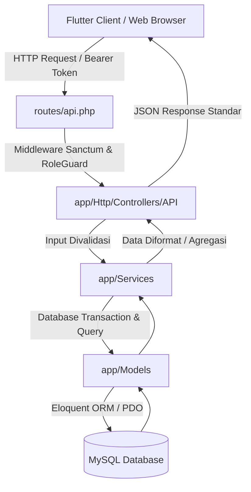
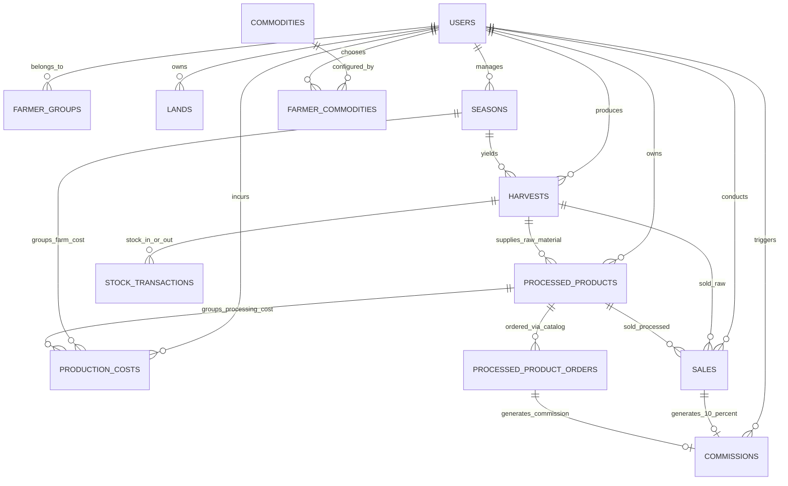
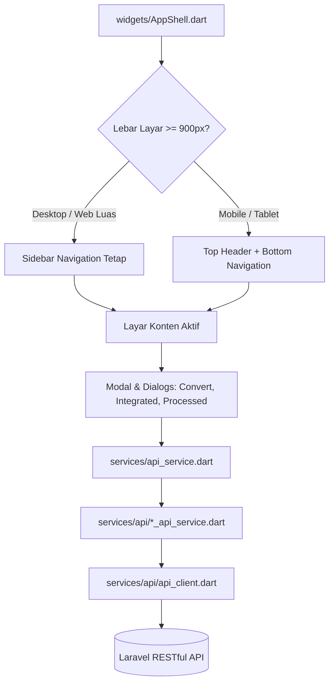
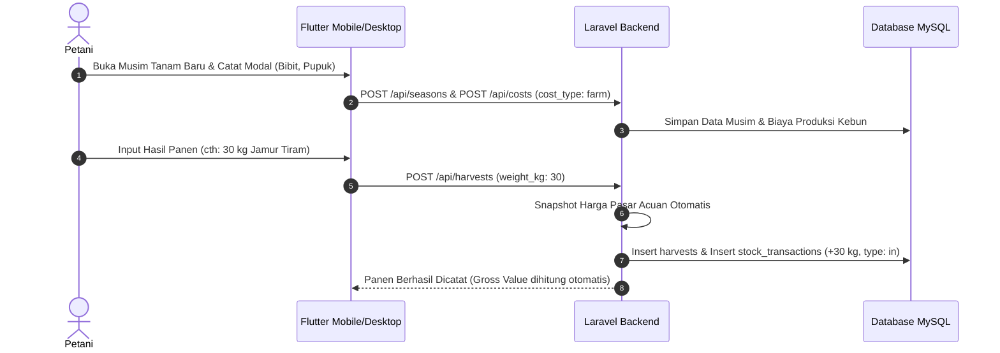
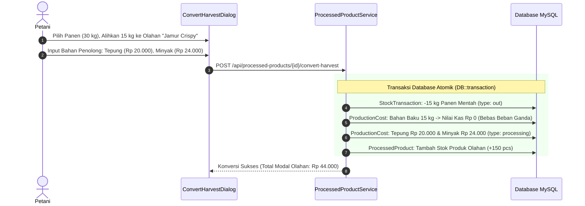
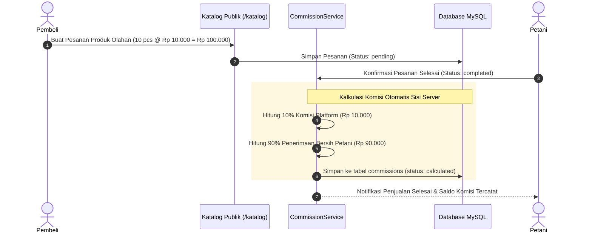

# Dokumentasi Arsitektur & Penjelasan Kode Lengkap (Codebase Documentation)
**Proyek:** SumberTani (SIMHPSK - PKM Kosabangsa)  
**Teknologi:** Laravel 11 (RESTful API Backend) + Flutter 3.x (Multiplatform Client: Web, Desktop, Mobile)  
**Terakhir Diperbarui:** September 2026  

---

## 📌 Daftar Isi
1. [Ikhtisar Sistem & Visi Platform](#1-ikhtisar-sistem--visi-platform)
2. [Peta Struktur Direktori Monorepo](#2-peta-struktur-direktori-monorepo)
3. [Arsitektur Backend (Laravel 11)](#3-arsitektur-backend-laravel-11)
   - [A. Pola Desain (Controller-Service-Model)](#a-pola-desain-controller-service-model)
   - [B. Diagram Relasi Entitas & Basis Data (ERD)](#b-diagram-relasi-entitas--basis-data-erd)
   - [C. Rincian Model & Peran Bisnis](#c-rincian-model--peran-bisnis)
   - [D. Rincian Service Layer (Logika Inti)](#d-rincian-service-layer-logika-inti)
   - [E. Autentikasi, Otorisasi & Keamanan Multi-Tenant](#e-autentikasi-otorisasi--keamanan-multi-tenant)
4. [Arsitektur Frontend (Flutter Client)](#4-arsitektur-frontend-flutter-client)
   - [A. Manajemen State & Navigasi](#a-manajemen-state--navigasi)
   - [B. Desain Responsif & Komponen Inti (`AppShell`)](#b-desain-responsif--komponen-inti-appshell)
   - [C. Service Layer API Modular](#c-service-layer-api-modular)
   - [D. Type-Safe Model Deserialization](#d-type-safe-model-deserialization)
   - [E. Komponen Dialog Khusus](#e-komponen-dialog-khusus)
5. [Alur Bisnis Utama (Core Workflows)](#5-alur-bisnis-utama-core-workflows)
   - [Alur 1: Hulu Kebun (Tanam -> Biaya -> Panen -> Stok)](#alur-1-hulu-kebun-tanam---biaya---panen---stok)
   - [Alur 2: Konversi Hasil Panen Menjadi Produk Olahan (Zero Double-Counting)](#alur-2-konversi-hasil-panen-menjadi-produk-olahan-zero-double-counting)
   - [Alur 3: Penjualan & Perhitungan Komisi Platform (10%)](#alur-3-penjualan--perhitungan-komisi-platform-10)
   - [Alur 4: Analisis Laba/Rugi Agribisnis Terpadu (Hulu-Hilir)](#alur-4-analisis-labarugi-agribisnis-terpadu-hulu-hilir)
6. [Katalog Endpoint RESTful API](#6-katalog-endpoint-restful-api)
7. [Pengujian & Jaminan Mutu (Quality Assurance)](#7-pengujian--jaminan-mutu-quality-assurance)
8. [Panduan Instalasi & Eksekusi Lokal](#8-panduan-instalasi--eksekusi-lokal)

---

## 1. Ikhtisar Sistem & Visi Platform

**SumberTani (SIMHPSK)** adalah platform digital agribisnis hulu-ke-hilir yang dirancang untuk kelompok tani (poktan) dan petani mandiri. Platform ini menjembatani dua dunia yang sebelumnya terpisah:
1. **Sisi Hulu (On-Farm / Budidaya):** Pencatatan lahan, komoditas, musim tanam, biaya operasional kebun (benih, pupuk, tenaga kerja), pencatatan panen terverifikasi harga acuan pasar, dan manajemen saldo stok gudang hasil tani.
2. **Sisi Hilir (Off-Farm / Pascapanen & Komersial):** Pengolahan hasil panen mentah menjadi produk bernilai tambah (misal: jamur tiram segar menjadi keripik jamur crispy), inventori produk olahan, katalog digital publik, serta perhitungan bagi hasil komisi platform (10%).

### Prinsip Utama Sistem:
* **Zero Double-Counting:** Pengalihan panen ke produk olahan tidak membebankan modal ganda atas bahan baku yang sudah dibiayai di kebun.
* **Multi-Tenancy Aman:** Isolasi data ketat antar petani; seorang petani tidak dapat melihat maupun memanipulasi data petani lain.
* **Single Source of Truth:** Semua perhitungan margin, komisi, dan saldo stok dihitung secara atomik di sisi server dalam transaksi basis data (`DB::transaction`).

---

## 2. Peta Struktur Direktori Monorepo

```plaintext
d:/laragon/www/PKM/
├── app/                        # [Backend] Kode Inti Aplikasi Laravel
│   ├── Http/
│   │   ├── Controllers/        # HTTP Request Handlers (RESTful Controllers)
│   │   │   ├── API/            # Controller khusus endpoint mobile/API JSON
│   │   │   └── ...             # Web Controllers (Katalog & Landing Page Blade)
│   │   └── Middleware/         # Rate limiting, Role Guard, Sanctum Token Auth
│   ├── Models/                 # Eloquent ORM Entities & Relasi Database
│   └── Services/               # Domain Business Logic (Service Layer)
├── bootstrap/                  # Inisialisasi framework Laravel
├── config/                     # Konfigurasi aplikasi, database, sanctum, dll.
├── database/
│   ├── migrations/             # Definisi skema tabel & evolusi database
│   └── seeders/                # Data awal (Super admin, komoditas, poktan)
├── docs/                       # Dokumentasi resmi arsitektur & changelog
├── mobile_app/                 # [Frontend] Proyek Flutter Multiplatform
│   ├── lib/
│   │   ├── models/             # Model data Dart dengan safe JSON deserializer
│   │   ├── providers/          # State management (AuthProvider, dll.)
│   │   ├── screens/            # Tampilan layar (Desktop/Mobile adaptive)
│   │   ├── services/           # HTTP Client & Modular API Services
│   │   └── widgets/            # Reusable UI Components, Dialogs & AppShell
│   └── pubspec.yaml            # Dependensi paket Flutter
├── public/                     # Dokumen web publik & storage symlink
├── resources/views/            # Template Blade (Landing Page & Katalog Publik)
├── routes/
│   ├── api.php                 # Rute RESTful API (Sanctum protected)
│   └── web.php                 # Rute web publik (/ dan /katalog)
└── tests/
    └── Feature/API/            # Automated Integration & Feature Tests
```

---

## 3. Arsitektur Backend (Laravel 11)

### A. Pola Desain (Controller-Service-Model)
Backend menerapkan arsitektur **Thin Controller, Fat Service**:
* **Controller:** Hanya bertugas memvalidasi input HTTP request, memanggil service terkait, dan mengembalikan respon JSON standar (`success`, `message`, `data`).
* **Service:** Memusatkan seluruh logika bisnis, kalkulasi keuangan, validasi lintas entitas, dan mutasi data database yang dibungkus dalam `DB::transaction`.
* **Model:** Merepresentasikan tabel database, mendefinisikan casting data, relasi Eloquent, query scopes, dan accessor/mutator.



---

### B. Diagram Relasi Entitas & Basis Data (ERD)



---

### C. Rincian Model & Peran Bisnis

| Model ([`app/Models/`](file:///d:/laragon/www/PKM/app/Models/)) | Tabel Basis Data | Tanggung Jawab Utama |
|---|---|---|
| [`User.php`](file:///d:/laragon/www/PKM/app/Models/User.php) | `users` | Entitas akun pengguna. Memiliki peran (`role`): `super_admin` atau `farmer`. Berelasi dengan kelompok tani (`farmer_group_id`). |
| [`FarmerGroup.php`](file:///d:/laragon/www/PKM/app/Models/FarmerGroup.php) | `farmer_groups` | Kelompok tani (Poktan). Menyimpan profil organisasi, ketua, desa, kontak, dan daftar anggota petani. |
| [`Commodity.php`](file:///d:/laragon/www/PKM/app/Models/Commodity.php) | `commodities` | Master data komoditas pertanian (Kentang, Jamur Tiram, Cabai, Jagung, dll.) beserta kode dan satuan baku. |
| [`FarmerCommodity.php`](file:///d:/laragon/www/PKM/app/Models/FarmerCommodity.php) | `farmer_commodities` | Pivot profil komoditas yang aktif dibudidayakan oleh petani tertentu dengan harga patokan lokal. |
| [`Land.php`](file:///d:/laragon/www/PKM/app/Models/Land.php) | `lands` | Metadata petak lahan petani (luas m², lokasi koordinat, status kepemilikan). |
| [`Season.php`](file:///d:/laragon/www/PKM/app/Models/Season.php) | `seasons` | Siklus musim tanam kebun. Memiliki status (`active`, `completed`, `cancelled`). Mengikat biaya operasional kebun dan hasil panen. |
| [`ProductionCost.php`](file:///d:/laragon/www/PKM/app/Models/ProductionCost.php) | `production_costs` | Buku besar modal pengeluaran. Mendukung dua tipe biaya (`cost_type`): `'farm'` (modal kebun terikat `season_id`) dan `'processing'` (modal bahan penolong terikat `processed_product_id`). |
| [`Harvest.php`](file:///d:/laragon/www/PKM/app/Models/Harvest.php) | `harvests` | Catatan hasil panen kebun. Menyimpan bobot fisik panen, snapshot harga pasar acuan saat panen, nilai kotor (*gross value*), dan foto dokumentasi. |
| [`StockTransaction.php`](file:///d:/laragon/www/PKM/app/Models/StockTransaction.php) | `stock_transactions` | Audit trail pergerakan stok gudang secara atomik (`in` dari panen, `out` dialihkan ke olahan atau dijual langsung). |
| [`ProcessedProduct.php`](file:///d:/laragon/www/PKM/app/Models/ProcessedProduct.php) | `processed_products` | Master dan inventori produk hilir olahan hasil tani mandiri (stok, harga jual, foto, satuan pcs/kg, referensi `harvest_id`, dan bobot bahan baku). |
| [`Sale.php`](file:///d:/laragon/www/PKM/app/Models/Sale.php) | `sales` | Transaksi penjualan langsung hasil panen atau produk olahan oleh petani ke tengkulak/pasar. |
| [`ProcessedProductOrder.php`](file:///d:/laragon/www/PKM/app/Models/ProcessedProductOrder.php) | `processed_product_orders` | Pesanan masuk dari publik/pembeli melalui landing page katalog web `/katalog`. |
| [`Commission.php`](file:///d:/laragon/www/PKM/app/Models/Commission.php) | `commissions` | Pencatatan otomatis hak komisi platform 10% dari nilai transaksi kotor penjualan/pesanan. Bersifat *immutable*. |
| [`HistoricalMarketPrice.php`](file:///d:/laragon/www/PKM/app/Models/HistoricalMarketPrice.php) | `historical_market_prices` | Data historis harga pasar komoditas per wilayah sebagai dasar kalkulasi evaluasi ekonomi panen. |

---

### D. Rincian Service Layer (Logika Inti)

1. **[`HarvestService.php`](file:///d:/laragon/www/PKM/app/Services/HarvestService.php)**:
   * Menangani pencatatan hasil panen baru.
   * Mengambil snapshot harga acuan pasar regional secara otomatis jika tersedia.
   * Menambah saldo stok gudang komoditas melalui `StockTransaction` (tipe `in`).

2. **[`ProcessedProductService.php`](file:///d:/laragon/www/PKM/app/Services/ProcessedProductService.php)**:
   * **`convertHarvestToProcessedProduct()`**: Mengonversi sejumlah bobot panen (kg) menjadi stok produk olahan.
   * Memotong stok gudang mentah secara atomik (`StockTransaction` tipe `out`).
   * Menulis entri bahan baku utama ke `production_costs` dengan nilai kas **Rp 0** (*Zero Double-Counting principle*).
   * Menulis itemized bahan penolong (tepung, minyak, bumbu, kemasan) ke `production_costs` tipe `processing`.

3. **[`FarmerEconomicResultService.php`](file:///d:/laragon/www/PKM/app/Services/FarmerEconomicResultService.php)**:
   * **`getSeasonEconomicSummary()`**: Menghitung laba/rugi satu musim tanam (Nilai Panen Kotor - Modal Tanam).
   * **`getProcessedProductEconomicSummary()`**: Menghitung modal per unit (HPP), penghematan bahan baku, omset penjualan, dan margin laba produk olahan.
   * **`getIntegratedEconomicSummary()`**: Agregasi performa holistik agribisnis petani:
     $$\text{Laba Bersih Terpadu} = \text{Laba Bersih Hulu (Kebun)} + \text{Laba Bersih Hilir (Olahan)}$$

4. **[`CommissionService.php`](file:///d:/laragon/www/PKM/app/Services/CommissionService.php)**:
   * Dijalankan otomatis saat pesanan katalog berstatus `completed` atau penjualan dicatat.
   * Mengkalkulasi 10% dari *Gross Amount*:
     $$\text{Komisi Platform} = 10\% \times \text{Nilai Transaksi Kotor}$$
     $$\text{Penerimaan Bersih Petani} = 90\% \times \text{Nilai Transaksi Kotor}$$
   * Terisolasi dari biaya produksi petani sehingga tidak dapat direkayasa.

---

### E. Autentikasi, Otorisasi & Keamanan Multi-Tenant

* **Autentikasi:** Menggunakan Laravel Sanctum dengan personal access tokens berotentikasi Bearer Token.
* **Role Guard:** Middleware membatasi rute khusus `super_admin` (seperti manajemen pengguna, ringkasan komisi agregat) vs `farmer`.
* **Multi-Tenancy Scoping:** Setiap query data pada `Harvest`, `ProductionCost`, `ProcessedProduct`, dan `Sale` secara wajib memfilter kolom `user_id = Auth::id()`. Upaya akses ID lintas petani memicu HTTP 403 Forbidden.

---

## 4. Arsitektur Frontend (Flutter Client)

Frontend berlokasi di direktori [`mobile_app/`](file:///d:/laragon/www/PKM/mobile_app/) dan dikompilasi untuk target **Web (Edge/Chrome)**, **Desktop (Windows)**, serta **Mobile (Android/iOS)**.



---

### A. Manajemen State & Navigasi
* Menggunakan paket **Provider** (`ChangeNotifierProvider`) dengan [`AuthProvider`](file:///d:/laragon/www/PKM/mobile_app/lib/providers/auth_provider.dart) sebagai pusat status autentikasi, profil pengguna, dan token sesi (`SharedPreferences`).
* Navigasi halaman dirancang dengan *fade transition* halus tanpa kedip untuk kenyamanan pengguna desktop maupun mobile.

---

### B. Desain Responsif & Komponen Inti (`AppShell`)
* [`AppShell.dart`](file:///d:/laragon/www/PKM/mobile_app/lib/widgets/app_shell.dart) membungkus seluruh layar aplikasi dengan sistem adaptif seragam pada ambang batas **900px**:
  * **Desktop ($\ge 900\text{px}$):** Menampilkan sidebar hijau tua permanen dengan navigasi lengkap, avatar profil super admin/petani, breadcrumb judul, dan tombol aksi header (`headerActions`).
  * **Mobile ($< 900\text{px}$):** Menampilkan AppBar ringkas, bilah navigasi bawah ([`AppBottomNav`](file:///d:/laragon/www/PKM/mobile_app/lib/widgets/app_bottom_nav.dart)), dan tombol aksi melayang (*Floating Action Button*).

---

### C. Service Layer API Modular
Direktori [`mobile_app/lib/services/api/`](file:///d:/laragon/www/PKM/mobile_app/lib/services/api/) memisahkan pemanggilan HTTP per domain bisnis yang diakses melalui facade [`ApiService`](file:///d:/laragon/www/PKM/mobile_app/lib/services/api_service.dart):
* `HarvestApiService`: Manajemen panen dan riwayat.
* `ProcessedProductApiService`: CRUD olahan, unggah foto multipart, dan pemanggilan endpoint konversi panen.
* `FarmerEconomicResultApiService`: Mengambil ringkasan ekonomi musim tanam dan ringkasan agribisnis terpadu.
* `CommissionApiService`: Mengambil histori komisi dan ringkasan KPI komisi platform.

---

### D. Type-Safe Model Deserialization
Untuk mencegah galat runtime umum seperti:
`TypeError: "10.00": type 'String' is not a subtype of type 'num?'`
Semua model data di [`mobile_app/lib/models/`](file:///d:/laragon/www/PKM/mobile_app/lib/models/) menggunakan fungsi konverter aman:
```dart
double _toDouble(dynamic v, [double defaultValue = 0.0]) {
  if (v == null) return defaultValue;
  if (v is num) return v.toDouble();
  if (v is String) return double.tryParse(v) ?? defaultValue;
  return defaultValue;
}
```
Pola ini diterapkan pada seluruh model keuangan: [`commission.dart`](file:///d:/laragon/www/PKM/mobile_app/lib/models/commission.dart), [`processed_product.dart`](file:///d:/laragon/www/PKM/mobile_app/lib/models/processed_product.dart), dan [`economic_result.dart`](file:///d:/laragon/www/PKM/mobile_app/lib/models/economic_result.dart).

---

### E. Komponen Dialog Khusus

1. **[`ConvertHarvestDialog.dart`](file:///d:/laragon/www/PKM/mobile_app/lib/widgets/convert_harvest_dialog.dart)**:
   * Formulir cerdas untuk mengalihkan sebagian hasil panen ke produk olahan.
   * Menampilkan pemilih panen, input bobot kg, banner edukasi *Zero Double-Counting (Rp 0 Kas)*, target produk olahan (buat baru atau tambah stok yang ada), serta tabel baris bahan penolong dinamis (Tepung, Minyak, Kemasan) dengan auto-subtotal.

2. **[`IntegratedEconomicDialog.dart`](file:///d:/laragon/www/PKM/mobile_app/lib/widgets/integrated_economic_dialog.dart)**:
   * Modal evaluasi finansial komparatif:
     * **Kartu Hulu (Kebun):** Modal Tanam, Omset Panen, Laba Bersih Hulu.
     * **Kartu Hilir (Olahan):** Bahan Baku Panen (Rp 0), Modal Bahan Penolong, Hasil Penjualan Olahan, Laba Bersih Hilir.
     * **Banner Grand Total:** Laba Bersih Terpadu Hulu + Hilir.

3. **[`ProcessedEconomicDialog.dart`](file:///d:/laragon/www/PKM/mobile_app/lib/widgets/processed_economic_dialog.dart)**:
   * Rincian mendalam performa finansial per varian produk olahan (HPP per unit, tabel biaya bahan penolong, pendapatan terwujud, dan persentase margin keuntungan).

---

## 5. Alur Bisnis Utama (Core Workflows)

### Alur 1: Hulu Kebun (Tanam -> Biaya -> Panen -> Stok)


---

### Alur 2: Konversi Hasil Panen Menjadi Produk Olahan (Zero Double-Counting)


---

### Alur 3: Penjualan & Perhitungan Komisi Platform (10%)


---

### Alur 4: Analisis Laba/Rugi Agribisnis Terpadu (Hulu-Hilir)
Contoh kasus riil:
1. **Modal Tanam Kebun:** Rp 200.000.
2. **Hasil Panen:** 30 kg Jamur Tiram @ Rp 10.000/kg = Nilai Panen Rp 300.000.
   * *Laba Bersih Hulu = Rp 300.000 - Rp 200.000 = Rp 100.000.*
3. **Pengalihan ke Olahan:** 15 kg dialihkan menjadi 150 pcs Jamur Crispy.
   * Bahan baku 15 kg bernilai kas **Rp 0** (karena modal Rp 200.000 sudah dihitung di kebun).
   * Modal bahan penolong tambahan = Rp 44.000.
   * Penjualan 150 pcs @ Rp 5.000 = Omset Olahan Rp 750.000.
   * *Laba Bersih Hilir = Rp 750.000 - Rp 44.000 = Rp 706.000.*
4. **Performa Agribisnis Terpadu Petani:**
   $$\text{Total Laba Bersih Agribisnis} = \text{Rp } 100.000 + \text{Rp } 706.000 = \mathbf{\text{Rp } 806.000}$$

---

## 6. Katalog Endpoint RESTful API

Seluruh rute API diawali prefiks `/api` dan mewajibkan header `Authorization: Bearer <token>` kecuali rute tamu (login/register).

### 🔑 Autentikasi & Pengguna
| Method | Endpoint | Hak Akses | Deskripsi |
|---|---|---|---|
| `POST` | `/api/login` | Publik | Otentikasi email/password & penerbitan token. |
| `POST` | `/api/register` | Publik | Pendaftaran akun petani baru. |
| `POST` | `/api/logout` | Terotentikasi | Revokasi personal access token. |
| `GET` | `/api/user` | Terotentikasi | Profil pengguna yang sedang login. |
| `GET` | `/api/users` | Super Admin | Daftar semua pengguna beserta status & peran. |
| `POST` | `/api/users/{id}/toggle-status` | Super Admin | Mengaktifkan/menonaktifkan akun pengguna. |

### 🌾 Manajemen Hulu Kebun
| Method | Endpoint | Hak Akses | Deskripsi |
|---|---|---|---|
| `GET` / `POST` | `/api/lands` | Petani | Daftar petak lahan & tambah lahan baru. |
| `GET` / `POST` | `/api/seasons` | Petani | Daftar musim tanam & mulai musim tanam baru. |
| `GET` / `POST` | `/api/costs` | Petani | Daftar biaya & input pengeluaran kebun/olahan. |
| `GET` / `POST` | `/api/harvests` | Petani | Daftar hasil panen & input panen baru. |
| `DELETE` | `/api/harvests/{id}` | Petani | Menghapus data panen miliknya. |
| `GET` | `/api/harvests/{id}/economic-result` | Petani | Analisis margin ekonomi panen spesifik. |

### 🍳 Produk Olahan, Konversi & Agribisnis Hilir
| Method | Endpoint | Hak Akses | Deskripsi |
|---|---|---|---|
| `GET` / `POST` | `/api/processed-products` | Petani | Daftar produk olahan & tambah produk baru. |
| `POST` | `/api/processed-products/{id}` | Petani | Update data produk & unggah foto multipart. |
| `DELETE` | `/api/processed-products/{id}` | Petani | Hapus produk olahan. |
| `POST` | `/api/processed-products/{id}/convert-harvest` | Petani | **Konversi hasil panen ke olahan bebas dobel biaya.** |
| `GET` | `/api/processed-products/{id}/economic-summary` | Petani | Rincian ekonomi, modal penolong, & margin per olahan. |
| `GET` | `/api/farmer/integrated-economic-summary` | Petani | **Ringkasan laba/rugi agribisnis terpadu (Hulu + Hilir).** |

### 💰 Komisi Platform & Penjualan
| Method | Endpoint | Hak Akses | Deskripsi |
|---|---|---|---|
| `GET` | `/api/commissions` | Petani / Super Admin | Daftar transaksi komisi platform 10%. |
| `GET` | `/api/commissions/summary` | Super Admin | Total agregat komisi dan omset kotor nasional. |
| `GET` / `POST` | `/api/sales` | Petani | Riwayat penjualan langsung & pencatatan transaksi. |

---

## 7. Pengujian & Jaminan Mutu (Quality Assurance)

Sistem diuji menggunakan **Test-Driven Architecture**:

### A. Pengujian Backend (PHPUnit / Pest)
Direktori pengujian berada di [`tests/Feature/API/`](file:///d:/laragon/www/PKM/tests/Feature/API/). Seluruh 177 unit/feature test terverifikasi **100% Passed**.

Pengujian khusus fitur biaya olahan & laba/rugi terpadu:
* File: [`tests/Feature/API/ProcessedProductCostAndProfitLossTest.php`](file:///d:/laragon/www/PKM/tests/Feature/API/ProcessedProductCostAndProfitLossTest.php)
  1. `test_farmer_can_convert_harvest_to_processed_product_with_zero_double_counting`: Menguji konversi panen, pengurangan saldo stok mentah, dan pencatatan bahan baku Rp 0.
  2. `test_farmer_can_record_standalone_processing_cost_via_cost_api`: Menguji pencatatan modal bahan penolong via API biaya.
  3. `test_processed_product_economic_summary_computes_correct_profit_and_margins`: Menguji rumus margin dan laba bersih olahan.
  4. `test_farmer_integrated_economic_summary_combines_hulu_and_hilir_cleanly`: Menguji rumus laba gabungan hulu dan hilir.
  5. `test_multi_tenancy_farmer_cannot_convert_another_farmers_harvest`: Menguji proteksi otorisasi multi-tenant (HTTP 403).
  6. `test_multi_tenancy_farmer_cannot_add_processing_cost_to_another_farmers_product`: Menguji isolasi produk olahan antar petani.

### B. Pengujian Frontend (Flutter Static Analysis)
Kode Flutter diperiksa secara berkala menggunakan:
```bash
flutter analyze
```
Hasil: **0 Issues / Warnings / Errors**.

---

## 8. Panduan Instalasi & Eksekusi Lokal

### Kebutuhan Perangkat Lunak:
* PHP >= 8.2 & Composer
* MySQL / MariaDB (via Laragon / Docker)
* Node.js & NPM (untuk aset landing web)
* Flutter SDK >= 3.22

### 1. Menjalankan Backend (Laravel):
```bash
# Masuk ke direktori root proyek
cd d:/laragon/www/PKM

# Konfigurasi file environment
cp .env.example .env
# Sesuaikan DB_DATABASE, DB_USERNAME, DB_PASSWORD

# Pasang dependensi
composer install

# Jalankan migrasi & seeder
php artisan migrate --seed

# Buat symbolic link storage untuk foto upload
php artisan storage:link

# Jalankan server pengembangan
php artisan serve
```
Backend akan aktif di: `http://127.0.0.1:8000`.

### 2. Menjalankan Frontend (Flutter):
```bash
# Masuk ke direktori mobile_app
cd d:/laragon/www/PKM/mobile_app

# Pasang dependensi Flutter
flutter pub get

# Jalankan di browser Edge / Chrome
flutter run -d edge

# Atau jalankan di Windows Desktop
flutter run -d windows
```

### 3. Akun Pengujian Standar (Bawaan Seeder):
* **Super Admin:** `superadmin@simhpsk.com` / `password`
* **Petani Demo:** `petani@simhpsk.com` / `password`
