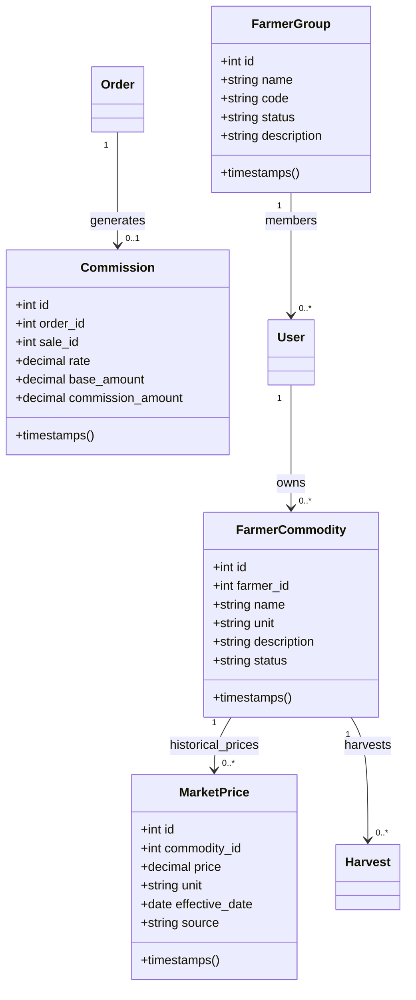

# SumberTani v2 — Domain & Schema Audit (Phase 1)

> **Dokumen:** V2 Domain Audit  
> **Tanggal:** 24 September 2026  
> **Status:** Selesai (Phase 1 Baseline Audit)  
> **Tujuan:** Memetakan seluruh entity, schema, relasi foreign key, dan titik integrasi actual code Laravel & Flutter sebelum migrasi domain v2 dimulai.

---

## 1. Audit Ringkasan Arsitektur

Arsitektur aplikasi SumberTani berjalan di atas prinsip Service Layer & Multi-Tenancy:
```text
Request ➔ Route (auth:sanctum, role guard) ➔ Controller ➔ Service ➔ Model ➔ Database
```
Semua aturan bisnis, validasi mutasi stok, pembuatan transaksi, dan kalkulasi keuangan terisolasi di dalam **Service Layer** dan dibungkus `DB::transaction` secara atomik.

---

## 2. Audit Model & Tabel Existing

### A. Model `User` (`users`)
* **Tabel:** `users`
* **Model:** [`app/Models/User.php`](file:///d:/laragon/www/PKM/app/Models/User.php)
* **Atribut Fillable:** `name`, `email`, `password`, `phone`, `farm_name`, `role`, `status`, `approval`.
* **Role:**
  - `user` (Petani Mitra)
  - `super_admin` (Pengelola Platform / Koperasi)
* **Kondisi Saat Ini:** Belum memiliki relasi ke kelompok tani (*Poktan*).
* **Titik Integrasi v2 (P2 - Poktan):**
  - Menambahkan kolom `farmer_group_id` (foreign key `nullable` ke `farmer_groups.id`, `onDelete('set null')`).
  - Kolom wajib diisi (*required*) saat registrasi Petani (`role = 'user'`).
  - Relasi Eloquent: `belongsTo(FarmerGroup::class, 'farmer_group_id')`.

---

### B. Model `Season` (`seasons`)
* **Tabel:** `seasons`
* **Model:** [`app/Models/Season.php`](file:///d:/laragon/www/PKM/app/Models/Season.php)
* **Atribut Fillable:** `user_id`, `name`, `start_date`, `end_date`, `status`, `target_kg`.
* **Casts & Appends:** `start_date` (date), `end_date` (date), `computed_status` (active/belum_dimulai/completed/cancelled).
* **Relasi:** `user()` (belongsTo), `harvests()` (hasMany), `costs()` (hasMany).
* **Kondisi Saat Ini:** Mengelompokkan aktivitas panen dan biaya produksi berdasarkan siklus tanam petani. Belum terhubung dengan nama komoditas dinamis.
* **Titik Integrasi v2 (P3/P4 - Commodity & Cost):**
  - Menambahkan relasi ke komoditas hasil tani `commodity_id` (foreign key nullable ke `farmer_commodities.id`).
  - Menjaga kalkulasi status otomatis `computeStatus()` agar tidak rusak.

---

### C. Model `Harvest` (`harvests`)
* **Tabel:** `harvests`
* **Model:** [`app/Models/Harvest.php`](file:///d:/laragon/www/PKM/app/Models/Harvest.php)
* **Atribut Fillable:** `user_id`, `season_id`, `quantity`, `date`, `weight_kg`, `notes`, `photo`, `status`.
* **Casts:** `date` (date), `weight_kg` (decimal:2).
* **Relasi:** `user()`, `season()`.
* **Kondisi Saat Ini:**
  - Setiap pencatatan panen memicu penambahan stok gudang mentah secara atomik melalui `StockTransaction::addTransaction('in', weight_kg, ...)`.
  - Bobot panen bertipe desimal presisi (`decimal:2`).
* **Titik Integrasi v2 (P4/P5 - Commodity, Market Price, & Allocation):**
  - Menambahkan `commodity_id` (foreign key ke `farmer_commodities.id`).
  - Menambahkan `market_price_snapshot` (decimal:2) dan `market_price_id` (foreign key nullable ke `market_prices.id`) untuk mencatat harga pasar historis yang berlaku pada tanggal panen.
  - Menambahkan `allocated_to_processed_kg` (decimal:2, default: 0) untuk mencatat pengalihan bahan baku ke produk olahan (*Internal Material Allocation*).

---

### D. Model `ProductionCost` (`production_costs`)
* **Tabel:** `production_costs`
* **Model:** [`app/Models/ProductionCost.php`](file:///d:/laragon/www/PKM/app/Models/ProductionCost.php)
* **Atribut Fillable:** `user_id`, `date`, `season_id`, `category`, `amount`, `notes`.
* **Kategori Resmi Existing:** `seed`, `fertilizer`, `pesticide`, `other`.
* **Kondisi Saat Ini:** Biaya dicatat per musim tanam (`season_id`) milik petani.
* **Titik Integrasi v2 (P4 - Cost Allocation):**
  - Mempertahankan 4 kategori resmi.
  - Membedakan konteks biaya:
    1. **Harvest Production Cost:** Terkait langsung dengan siklus tanam / hasil tani mentah (`season_id`).
    2. **Processed Product Additional Cost:** Biaya tambahan operasional pengolahan (tepung, minyak, bumbu, packaging).
  - Menjaga prinsip **Anti Double-Counting**: Nilai komoditas panen yang dialihkan ke produk olahan tidak dicatat kembali sebagai pengeluaran kas.

---

### E. Model `Sale` (`sales`)
* **Tabel:** `sales`
* **Model:** [`app/Models/Sale.php`](file:///d:/laragon/www/PKM/app/Models/Sale.php)
* **Atribut Fillable:** `user_id`, `order_id`, `season_id`, `product_type`, `processed_product_id`, `created_by`, `date`, `buyer_name`, `buyer_phone`, `buyer_address`, `weight_kg`, `price_per_kg`, `total`, `payment_status`, `notes`.
* **Kondisi Saat Ini:** Mendukung penjualan komoditas mentah (`product_type = 'harvest'`) dan produk olahan (`product_type = 'processed'`). Penjualan olahan terhubung ke `order_id`.
* **Titik Integrasi v2 (P5/P8 - Commission & Transaction Price):**
  - Menjadi muara pencatatan penjualan resmi.
  - Transaksi pesanan olahan memicu perhitungan komisi platform 10%.

---

### F. Model `ProcessedProduct` (`processed_products`)
* **Tabel:** `processed_products`
* **Model:** [`app/Models/ProcessedProduct.php`](file:///d:/laragon/www/PKM/app/Models/ProcessedProduct.php)
* **Atribut Fillable:** `owner_id`, `name`, `price`, `stock`, `unit`, `description`, `photo`, `status`.
* **Unit Didukung:** `pcs` dan `kg`.
* **State Machine:**
  - `stock == 0` ➔ auto `out_of_stock` (kecuali `inactive`).
  - `stock > 0` ➔ auto `active`.
  - Guard: `stock >= 0`.
* **Titik Integrasi v2 (P4 - Traceability):**
  - Menambahkan relasi opsional `commodity_id` (foreign key nullable ke `farmer_commodities.id`) untuk melacak komoditas bahan baku asal produk olahan.

---

### G. Model `Order` & `OrderItem` (`orders`, `order_items`)
* **Tabel:** `orders`, `order_items`
* **Model:** [`app/Models/Order.php`](file:///d:/laragon/www/PKM/app/Models/Order.php), [`app/Models/OrderItem.php`](file:///d:/laragon/www/PKM/app/Models/OrderItem.php)
* **Kondisi Saat Ini:**
  - Guest checkout via katalog publik (`POST /api/public/orders`).
  - Mengunci snapshot harga (`price_snapshot`) dan subtotal per item.
  - Status lifecycle: `pending` ➔ `confirmed` ➔ `processing` ➔ `completed` / `cancelled`.
  - Penyelesaian pesanan (`completeOrder`) bersifat atomik dan idempoten (mencegah double completion).
* **Titik Integrasi v2 (P8 - Commission):**
  - Penambahan entity/tabel `commissions` yang di-insert secara otomatis dan idempoten saat `completeOrder` berlangsung.

---

### H. Model `StockTransaction` (`stock_transactions`)
* **Tabel:** `stock_transactions`
* **Model:** [`app/Models/StockTransaction.php`](file:///d:/laragon/www/PKM/app/Models/StockTransaction.php)
* **Kondisi Saat Ini:**
  - Audit trail mutasi stok (masuk & keluar).
  - Kolom `unit` dinamis (`kg` untuk panen, `pcs`/`kg` untuk olahan).
  - Pemisahan isolasi stok gudang mentah (`whereNull('processed_product_id')`) vs produk olahan.
* **Titik Integrasi v2 (P4 - Allocation):**
  - Menambahkan tipe transaksi `allocation_out` untuk mencatat pengurangan stok gudang mentah saat dialokasikan menjadi bahan olahan.

---

### I. Chatbot Controller & Knowledge Base
* **File:** [`app/Http/Controllers/Api/ChatbotController.php`](file:///d:/laragon/www/PKM/app/Http/Controllers/Api/ChatbotController.php)
* **Kondisi Saat Ini:** Berisi knowledge base operasional Super Admin (katalog, pemasaran, penjualan, akun petani).
* **Titik Integrasi v2 (P7 - Dual Context Chatbot):**
  - Memisahkan logic controller atau endpoint:
    - `/api/chatbot/farmer`: Khusus asistensi pertanian (budidaya komoditas, cuaca/musim, pupuk, hama, panen).
    - `/api/chatbot/super-admin`: Khusus asistensi bisnis platform (operasional, omset, stok, pengguna).
  - Role-based authorization & context protection di tingkat backend.

---

## 3. Entity Baru yang Akan Dibuat pada v2



---

## 4. Matriks Pemetaan Integrasi & Proteksi

| Entity Existing | Model Baru Terkait | Titik Integrasi | Dampak Regresi / Proteksi |
|---|---|---|---|
| `users` | `FarmerGroup` | Kolom `farmer_group_id` | Nullable untuk super admin, multi-tenancy aman |
| `seasons` | `FarmerCommodity` | Kolom `commodity_id` | Status otomatis musim tanam tetap aman |
| `harvests` | `FarmerCommodity`, `MarketPrice` | Kolom `commodity_id`, `market_price_snapshot` | Perhitungan bobot desimal tetap aman |
| `production_costs` | `FarmerCommodity`, `ProcessedProduct` | Relasi biaya panen vs biaya olahan | 4 kategori resmi tidak berubah, anti double counting |
| `orders` | `Commission` | Table `commissions` | Trigger hanya saat `completeOrder`, idempoten |
| `ChatbotController` | Context Knowledge Base | Pemisahan Context Petani vs Admin | Role guard sanctum wajib diterapkan |

Audit ini memastikan tidak ada model duplikat, tidak ada table rewrite ceroboh, dan seluruh pipeline existing terlindungi secara penuh.
