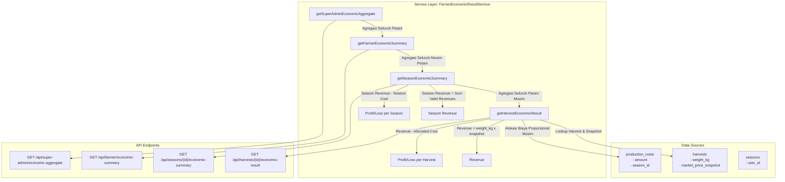

# Walkthrough — Phase 6: Farmer Economic Result

## 1. Executive Summary
Phase 6 mengimplementasikan kalkulasi **Hasil Ekonomi Petani (Farmer Economic Result)** pada platform **SumberTani berbasis AI**.

Fokus utama Phase 6:
1. **Formula Ekonomi yang Akurat & Adil**:
   - $\text{Revenue} = \text{weight\_kg} \times \text{Historical Market Price Snapshot}$
   - $\text{Harvest Allocated Cost} = \left(\frac{\text{harvest.weight\_kg}}{\text{total\_season\_harvest\_weight\_kg}}\right) \times \text{season\_total\_cost}$
   - $\text{Harvest Profit/Loss} = \text{Harvest Revenue} - \text{Harvest Allocated Cost}$
2. **Aturan Khusus Nilai NULL (Anti Asumsi 0)**:
   - Jika $\text{market\_price\_snapshot} = \text{NULL}$:
     - $\text{Revenue} = \text{NULL}$
     - $\text{Profit/Loss} = \text{NULL}$
     - *(Sistem tidak mengasumsikan Revenue = 0)*.
3. **Kalkulasi Musim (Season Summary)**:
   - $\text{Season Revenue} = \sum \text{harvest revenue yang valid}$
   - $\text{Season Production Cost} = \text{total biaya produksi musim}$
   - $\text{Season Profit/Loss} = \text{Season Revenue} - \text{Season Production Cost}$
4. **Preservasi Snapshot Historis (Phase 5)**:
   - Tidak mengubah mekanisme snapshotting Phase 5. Harga yang digunakan tetap snapshot yang terkunci pada catatan panen, bukan harga pasar terbaru saat ini.
5. **Multi-level Aggregation**:
   - **Per-Harvest**: Analisis laba/rugi per satuan catatan panen.
   - **Per-Season**: Agregasi ekonomi seluruh panen dalam satu musim tanam.
   - **Farmer Overall**: Ringkasan portofolio seluruh musim dan komoditas petani yang sedang login.
   - **Super Admin Aggregate**: Monitoring agregat ekonomi seluruh petani dan kelompok tani.
6. **Tenant Isolation & Security**:
   - Petani hanya dapat mengakses hasil panen dan musim milik dirinya sendiri (HTTP 403 Forbidden untuk cross-tenant).
   - Endpoint agregat platform hanya dapat diakses oleh Super Admin.
7. **Penyajian Data di Frontend Flutter**:
   - Tampilan rapi dengan 5 komponen esensial:
     1. **Hasil Panen**
     2. **Harga Pasar**
     3. **Revenue**
     4. **Allocated Production Cost**
     5. **Profit/Loss**
   - Dilengkapi dialog analisis modern di kartu panen mobile maupun tabel panen desktop.

---

## 2. Arsitektur & Alur Data



---

## 3. Komponen Backend

### A. Service: `FarmerEconomicResultService.php`
- [FarmerEconomicResultService.php](file:///d:/laragon/www/PKM/app/Services/FarmerEconomicResultService.php)
- Melakukan kalkulasi:
  - `getHarvestEconomicResult(Harvest $harvest)`: menghitung Revenue berdasarkan `weight_kg * market_price_snapshot`. Jika snapshot null, return `revenue = null` dan `profit_loss = null`.
  - `getSeasonEconomicSummary(Season $season, int $userId)`: merangkum seluruh panen dalam musim, menjumlahkan revenue yang valid ($\sum \text{valid harvest revenue}$), total biaya produksi musim, dan season profit/loss.
  - `getFarmerEconomicSummary(int $userId)`: merangkum performa ekonomi lintas musim bagi petani aktif.
  - `getSuperAdminEconomicAggregate()`: agregasi makro bagi Super Admin.

### B. Controller & Routes: `FarmerEconomicResultController.php`
- [FarmerEconomicResultController.php](file:///d:/laragon/www/PKM/app/Http/Controllers/Api/FarmerEconomicResultController.php)
- [routes/api.php](file:///d:/laragon/www/PKM/routes/api.php):
  - `GET /api/harvests/{harvest}/economic-result` (Petani - Tenant-isolated)
  - `GET /api/seasons/{season}/economic-summary` (Petani - Tenant-isolated)
  - `GET /api/farmer/economic-summary` (Petani)
  - `GET /api/super-admin/economic-aggregate` (Super Admin)

---

## 4. Komponen Frontend Flutter

### A. Model & API Services
- [economic_result.dart](file:///d:/laragon/www/PKM/mobile_app/lib/models/economic_result.dart):
  - `HarvestEconomicResult` (dengan property `revenue`, `allocatedProductionCost`, `profitLoss`, `marketPriceSnapshot`, `weightKg`)
  - `SeasonEconomicSummary` (dengan `seasonRevenue`, `seasonProductionCost`, `seasonProfitLoss`)
  - `FarmerEconomicSummary`
- [farmer_economic_result_api_service.dart](file:///d:/laragon/www/PKM/mobile_app/lib/services/api/farmer_economic_result_api_service.dart) & [api_service.dart](file:///d:/laragon/www/PKM/mobile_app/lib/services/api_service.dart)

### B. UI Presentation di Layar Panen
- [harvest_screen.dart](file:///d:/laragon/www/PKM/mobile_app/lib/screens/harvest_screen.dart):
  - Ditambahkan tombol aksi **Hasil Ekonomi** (icon `analytics_outlined`) pada kartu panen mobile dan baris data tabel desktop.
  - Menampilkan modal bottom sheet `_EconomicResultSheet` yang memuat 5 komponen rapi:
    1. **Hasil Panen**: bobot dasar kalkulasi `weight_kg` (dan kuantitas unit jika ada).
    2. **Harga Pasar**: snapshot nominal acuan pasar dan tanggal efektif (atau `NULL` jika belum ada).
    3. **Revenue**: `weight_kg * snapshot` (atau `NULL` jika snapshot null).
    4. **Allocated Production Cost**: alokasi biaya proporsional musim.
    5. **Profit/Loss**: `Revenue - Allocated Cost` (atau `NULL` jika snapshot null).

---

## 5. Hasil Pengujian & Verifikasi

### A. PHPUnit Feature Tests
Semua 11 skenario pengujian di [FarmerEconomicResultTest.php](file:///d:/laragon/www/PKM/tests/Feature/API/FarmerEconomicResultTest.php) lulus 100%:
1. ✔ Harvest economic result with price snapshot
2. ✔ Proportional cost allocation across multiple harvests
3. ✔ Loss scenario when cost exceeds revenue
4. ✔ Harvest without price snapshot returns null values (Revenue = NULL, Profit/Loss = NULL)
5. ✔ Farmer cannot access other farmers harvest result (403 Forbidden)
6. ✔ Season economic summary aggregates harvests
7. ✔ Season with mixed harvest snapshots aggregates valid revenues
8. ✔ Farmer cannot access other farmers season summary (403 Forbidden)
9. ✔ Farmer overall economic summary returns all seasons
10. ✔ Super admin can view economic aggregate
11. ✔ Farmer cannot access super admin aggregate (403 Forbidden)

**Full Test Suite**:
```bash
php vendor/phpunit/phpunit/phpunit tests/Feature/API/ 2>&1
# Result: 164 tests, 743 assertions — 100% PASSED
```

### B. Flutter Static Analysis
```bash
flutter analyze lib/screens/harvest_screen.dart lib/models/economic_result.dart
# Result: No issues found! (0 errors, 0 warnings)
```
